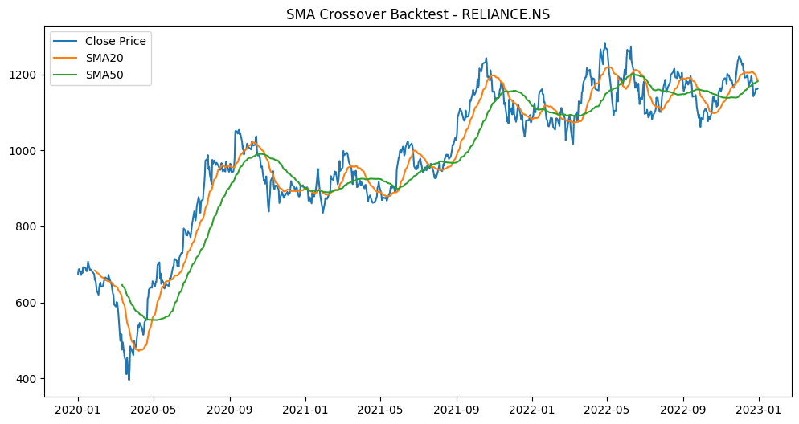

# YCapital Backtests – NSE & BSE

This repository contains systematic trading strategy backtests developed by **YCapital**.  

##  Strategy 1: SMA Crossover
- **Market:** NSE/BSE equities  
- **Logic:** Buy when the short-term SMA crosses above the long-term SMA, sell when it crosses below.  
- **Backtest Environment:** Python, pandas, matplotlib  
- **Status:** Initial version complete  

##  Next Steps
- Add more strategies (Momentum, Mean Reversion, Pairs Trading)  
- Upload performance charts (PnL, equity curve, drawdowns)  
- Automate with GitHub Actions for continuous testing  

---

### About YCapital
YCapital is building a systematic, research-driven backtesting framework for Indian markets.  

### Example Result

